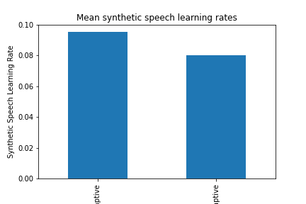

# replication-materials-AlexPrizzy

## Initial Findings

This repository contains the data and code for a study on auditory working memory training and synthetic speech learning for MACS 30200 "Perspectives on Computational Research" at the University of Chicago.

Data was collected in the Attention, Perception, EXperience (APEX) Lab in the department of Psychology at the University of Chicago. 

Participants were randomly assigned to two conditions of an auditory N-back task. Training group received an adaptive version of the N-back to train working memory. Control group received a non-adaptive 1-back task to account for confounding effects by length of exposure to computerized tasks. 

Participants also completed a synthetic speech learning task to measure effects of working memory task on learning. 

Hypothesis: Participants who complete the adaptive N-back task will have greater synthetic speech learning outcomes than participants who complete a non-adaptive N-back task. 

### Data Processing

import pandas as pd

#### Read the "participant_data.csv" file which contains:
    condition: Adaptive (Training) or Non-Adaptive(Control) N-back
    Pre-/Post-Test: Score from Synthetic Speech Learning task
    Learning Rate: Pretest - Posttest
 
'''
    data = "Data/participant_data.csv"
'''

Here we have preliminary data for four participants:
    2 Training, 2 Control

'''
    df = pd.read_csv(data)
'''

Get mean learning rate grouped by condition (Training or Control)

'''
    means = df.groupby(['condition'])['learning rate'].mean()
'''

Create bar plot of mean learning rates by condition

'''
    fig = means.plot(kind='bar', ylim=(0, .1),
               xlabel="Working Memory Task", ylabel="Synthetic Speech Learning Rate",
               title="Mean synthetic speech learning rates")
'''

### Results

The results of our data confirm the hypothesis. Participants who underwent adaptive working memory training had greater mean learning outcomes than control group participants who completed a non-adaptive working memory task

